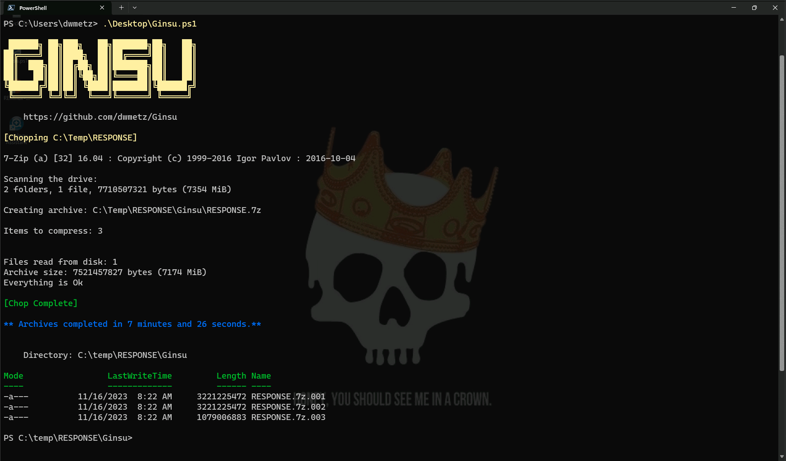

 
 

  <h2>
   Ginsu
  </h2>
  <h5>
      'Chops' collections to 3GB sections to traverse Microsoft Defender console
   </h5>

 

  
  

  <h5>
   Function:
  </h5>

> PowerShell utility to compresses a folder using 7zip and split the resulting archives into 3GB or less sections.
<h5>
   Prerequisites:
</h5>

>- [7za.exe](https://www.7-zip.org/a/7z2301-extra.7z) executable 'put' via Defender console

<h5>
   Notes:
</h5>

>- File Name: Ginsu.ps1
>- Author: Doug Metz
>- Version: 1.0

    
<h5>
   Synopsis:
</h5>

> This script uses 7zip (7za.exe) to compress a specified folder and then splits the resulting archive into sections of 3GB or less. It will work (and was designed for) files larger than 3GB.  Windows Defender Live Response currently only supports pulling back files of 3GB or less via the console. If your collection is larger than that, you will need to repackage it using Ginsu, or use a method outside of the console to retrieve the files.